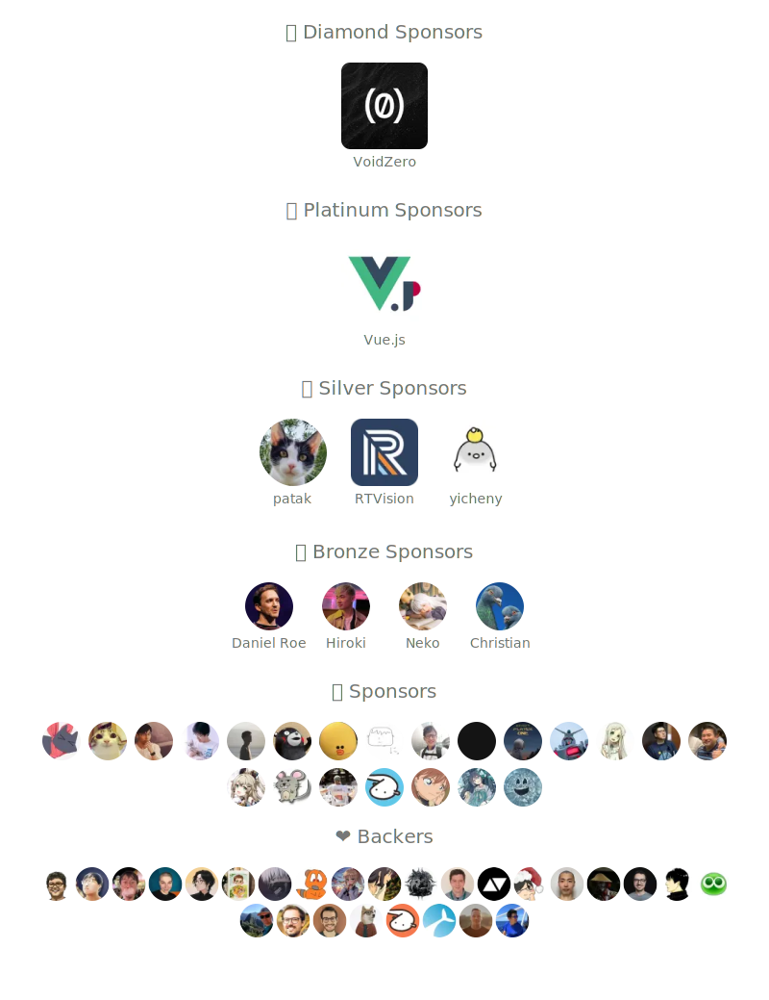

## Sponsors

If my code has helped you, please consider [sponsoring me](https://github.com/sponsors/sxzz).

-  [GitHub Sponsor](https://github.com/sponsors/sxzz)
-  Ethereum, Polygon: [sanxiaozhizi.eth](https://etherscan.io/address/0x86930e4c4ef9d62d44e3363e4d23e759bcdeeaa0)
- [Stripe](https://donate.stripe.com/aEU7sW3dJ2r15XO5kk)
- [爱发电](https://afdian.net/a/sanxiaozhizi)

Thank you for your support!

## Doc

- [中国大陆用户指南 / Chinese Guide](./doc/chinese-guide.md)

## Contact

- Telegram: [@sanxiaozhizi](https://t.me/sanxiaozhizi)
- Twitter: [@sanxiaozhizi](https://twitter.com/sanxiaozhizi)

  

## Thanks

Built with [SponsorKit](https://github.com/antfu/sponsorkit).
